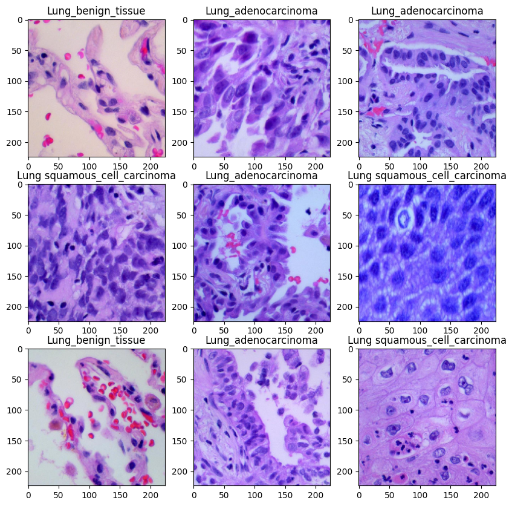
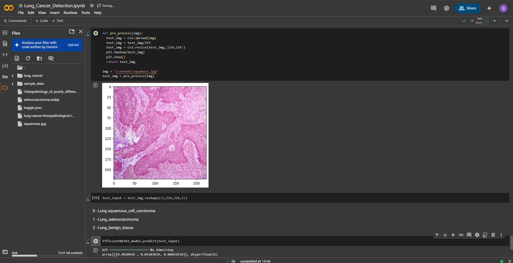

# Lung-cancer-detection
This project implements a Convolutional Neural Network (CNN) for lung cancer detection using medical imaging datasets. The model classifies lung tissue into benign tissue  ,  squamous_cell_carcinoma ,  adenocarcinoma aiding in early cancer diagnosis. It utilizes pretrained model EfficientNet B3

## Images

